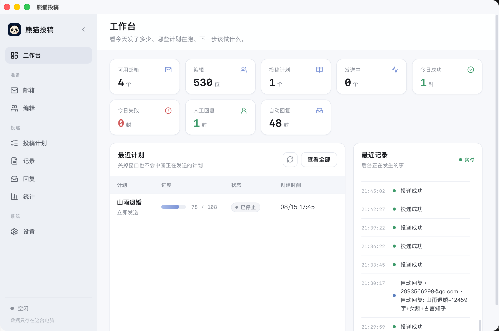

# Panda Submission (NovelSub)

[中文](README.md)

Panda Submission (NovelSub) is a local desktop submission tool for fiction writers. It brings sender accounts, editor contacts, manuscripts, submission plans, delivery logs, and editor replies into one workspace.

**Completely free and open source**: [https://github.com/logyxiao/PandaSub](https://github.com/logyxiao/PandaSub). Data is stored locally in SQLite, while submission tasks run in the Tauri background process.

<p align="center">
  
  <br />
  <em>熊猫投稿</em>
</p>


## Features

- **Sender account management**: Configure QQ, 163, and other SMTP accounts with authorization codes, pen names, and daily limits.
- **Editor library**: Manage editor addresses by platform, style, work type, and status; import or export Excel/CSV files.
- **Submission plans**: Edit manuscript metadata, message subject, body, recipients, and schedule in one workflow.
- **Per-plan account selection**: Choose exactly which enabled sender accounts participate in each submission plan.
- **Automatic pacing**: After each message, wait a random 2–4 minutes (peaking around 3 minutes) before sending the next one—no manual frequency setting.
- **Scheduling modes**: Send immediately, at a specified time, or repeatedly.
- **Delivery safeguards**: Hourly and daily account limits, rate-limit cooldowns, retries, pause, resume, and stop controls.
- **Delivery logs**: Track each message, filter by plan or result, and export to Excel.
- **Reply monitoring**: Check inboxes over IMAP and classify human replies, automated replies, and bounces.
- **Background execution**: Tasks can continue from the system tray after the main window is closed.

## Automatic Submission Pace

After each message is sent, the app waits a random **2–4 minutes** before the next one. Delays follow a triangular distribution that peaks around **3 minutes**, so the cadence feels closer to manual sending than a fixed timer.

Messages are sent sequentially. Account-level hourly and daily limits and cooldown rules still apply.

## Tech Stack

- [Tauri 2](https://tauri.app/)
- [React 19](https://react.dev/)
- [TypeScript 6](https://www.typescriptlang.org/)
- [Vite 8](https://vite.dev/)
- Rust + Tokio
- SQLite
- Lettre (SMTP)
- IMAP

## Requirements

- Node.js 20 or later
- npm
- Rust stable
- macOS: Xcode Command Line Tools
- Windows: Microsoft C++ Build Tools and WebView2

## Development

Install dependencies:

```bash
npm install
```

Run the complete desktop application:

```bash
npm run tauri dev
```

Run only the frontend:

```bash
npm run dev
```

The frontend-only mode cannot access SQLite, SMTP, IMAP, or other Tauri APIs.

## Build

Build and type-check the frontend:

```bash
npm run build
```

Run lint checks:

```bash
npm run lint
```

Check the Rust backend:

```bash
cd src-tauri
cargo check
```

Build desktop installers:

```bash
npm run tauri build
```

Configured bundle targets include macOS App/DMG and Windows NSIS.

## Project Structure

```text
NovelSub/
├── src/                    # React frontend
│   ├── components/         # Shared UI components
│   ├── views/              # Dashboard, accounts, editors, plans, logs, replies, settings
│   ├── api.ts              # Tauri command wrappers
│   └── types.ts            # Frontend types
├── src-tauri/              # Rust/Tauri backend
│   ├── src/commands.rs     # Tauri commands
│   ├── src/scheduler.rs    # Submission scheduler
│   ├── src/smtp.rs         # SMTP delivery
│   ├── src/imap.rs         # IMAP inbox scanning
│   ├── src/db.rs           # SQLite schema and migrations
│   └── tauri.conf.json     # Desktop application configuration
└── README.md
```

## Support the Author

PandaSub is completely free and open source. All features are available at no cost. If the app helps you, you are welcome to buy the author a coffee—sponsorship is voluntary and never unlocks or locks any feature.

<p align="center">
  
  &nbsp;&nbsp;&nbsp;
  
</p>

<p align="center">WeChat · Alipay</p>

Repository: [https://github.com/logyxiao/PandaSub](https://github.com/logyxiao/PandaSub)

## Local Data

Default database location on macOS:

```text
~/Library/Application Support/com.novelsub.desktop/novelsub.sqlite
```

The database stores sender accounts, editor contacts, manuscripts, plans, task state, delivery logs, replies, and settings. Backups can be created from **Settings → Data & Backup**.

## Email Security

- Use SMTP/IMAP authorization codes for QQ and 163 accounts instead of web login passwords.
- Authorization codes remain in the local database and are used only for sending mail and checking replies from this device.
- Configure reasonable daily limits and follow the rules of each email provider.
- Use **Test Send** before running a submission plan to verify the account and message content.
