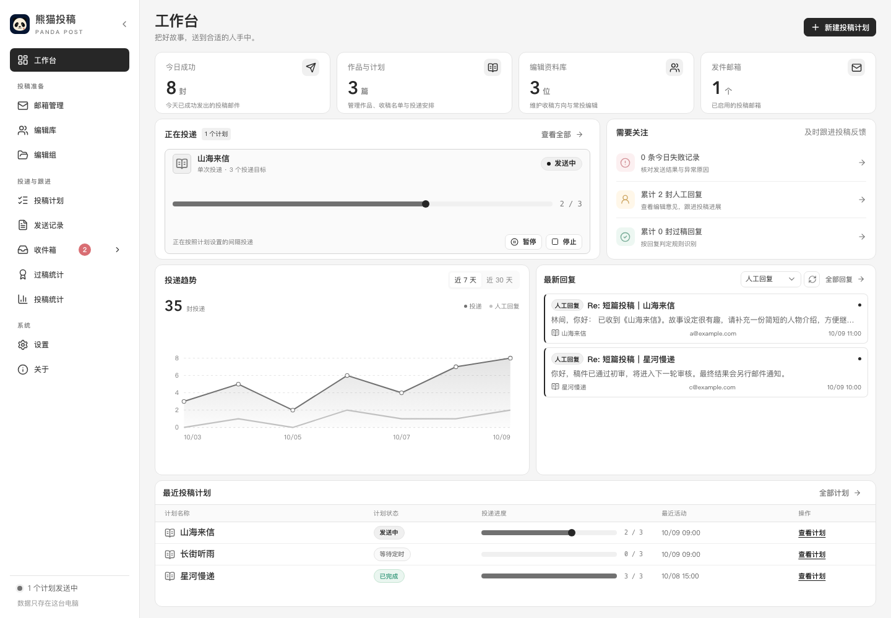
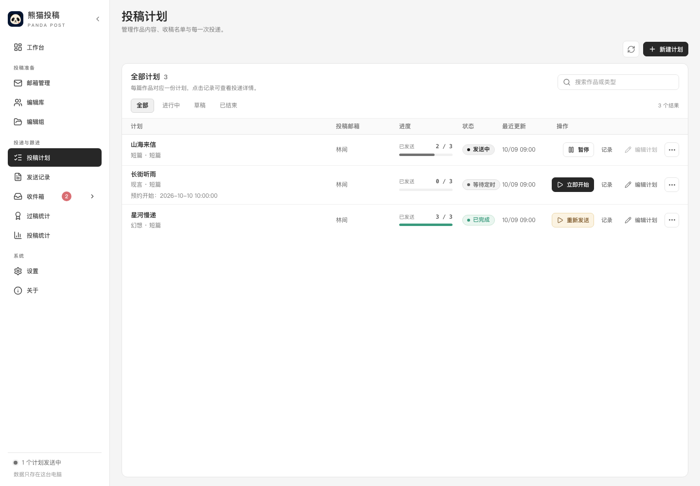
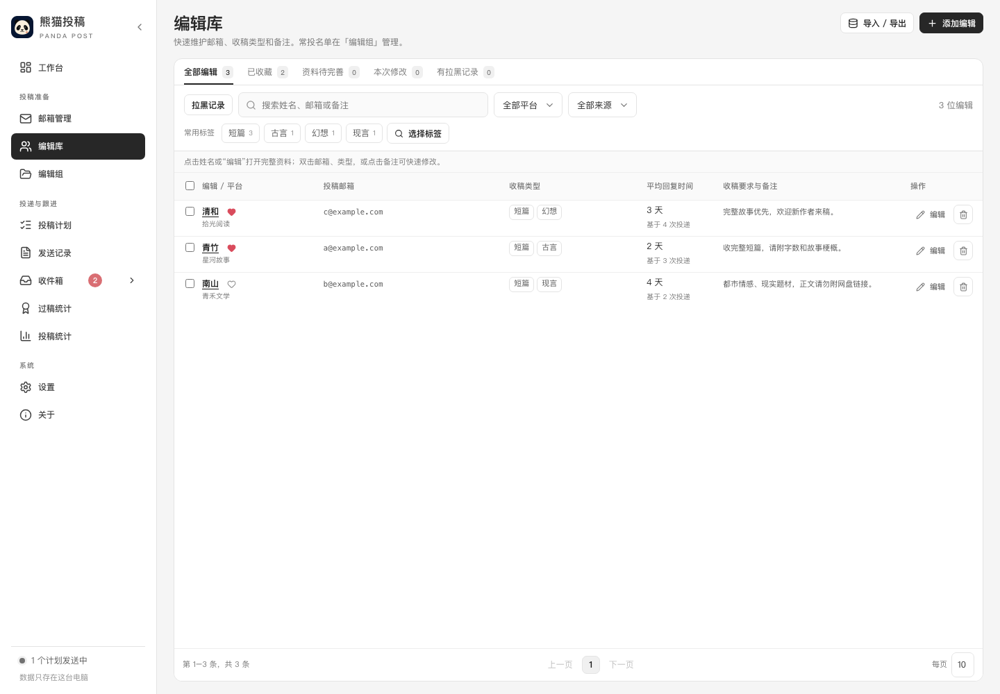
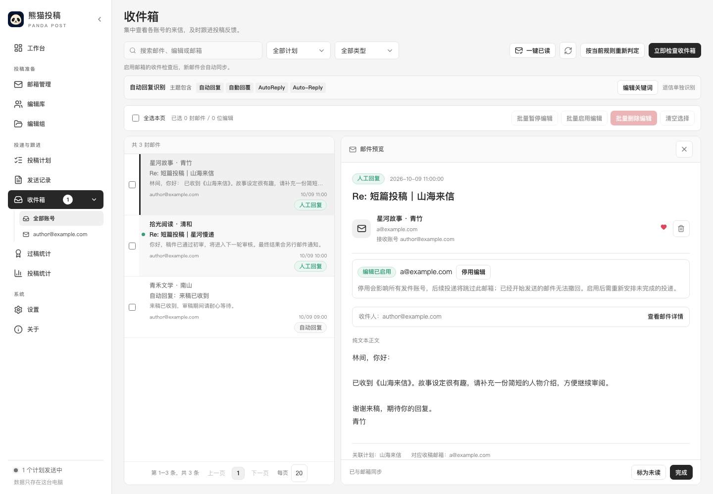
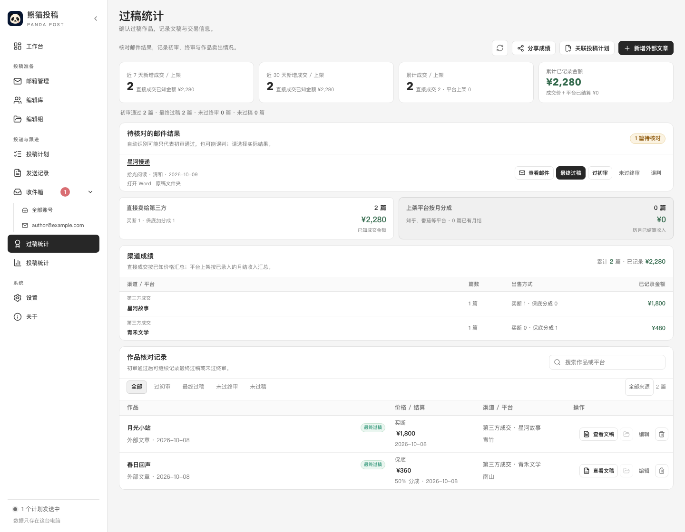

# Panda Submission (NovelSub)

[中文](README.md)

Panda Submission (NovelSub) is a local desktop submission tool for fiction writers. It brings sender accounts, editor contacts, manuscripts, submission plans, delivery logs, editor replies, and acceptance earnings into one workspace.

**Completely free and open source**: [https://github.com/logyxiao/PandaSub](https://github.com/logyxiao/PandaSub). Data is stored locally in SQLite, while submission tasks run in the Tauri background process.

<p align="center">
  
  <br />
  <em>Current dashboard · All manuscripts, addresses, replies, and amounts shown are fictional</em>
</p>


## Features

| Page | Capabilities |
| --- | --- |
| Dashboard | Follow active plans, items needing attention, 7/30-day delivery and human-reply trends, and recent mail. |
| Accounts | Manage SMTP/IMAP accounts, pen names, notes, sending limits, connection tests, and bulk account setup. Includes server presets for QQ, 163, 126, and Yeah. |
| Editors & groups | Filter by accepted/excluded genres, platform, favorites, availability, and sender blocks. Edit contacts inline, view average human response time and sample counts, import/export Excel or CSV, and maintain reusable groups across pages. |
| Plans | Prepare manuscript attachments and mail, choose recipients and sender accounts, then schedule delivery. Save drafts, copy plans, and inspect delivery details. Built-in mail templates support fixed or random selection; edits become defaults for new plans. |
| Delivery logs | Search by plan, result, and mailbox; inspect failures and export Excel. Pause, resume, stop, or retry delivery. |
| Inbox | Read ordinary mail and submission replies across accounts. Classify human replies, automated replies, and bounces; use a side-by-side preview, HTML/plain text, collapsed quotations, saved attachments, search, and synchronized read state. Mark all results in the current filter as read. |
| Acceptance | Review original mail and record preliminary approval, final acceptance, final rejection, or non-acceptance. Handle false positives, add external works, view/export manuscripts, track buyouts, guarantees plus royalties, per-thousand-character pricing and monthly settlements, and export achievement images. |
| Submission statistics | Review deliveries, human replies, acceptance replies, and failures by date range and day/week/month. |
| Settings | Switch between monochrome and bamboo-green themes; configure inbox checks, startup and tray behavior, backups, manual cache cleanup, storage usage, and application updates. |

The inbox can filter messages mentioning paused submissions and bulk pause, enable, or delete matching editor contacts across pages. **Pausing blocks subsequent deliveries; deleting a contact does not remove recipients from existing plans.** Average editor response time uses the first valid human reply after each successful delivery and includes a sample count.

Automatic acceptance detection prompts a manual review. Preliminary approval is separate from final acceptance. Recorded earnings reflect entered prices and settled royalties, not automatically verified payments.

## Screenshots

These are current React pages rendered with isolated fictional data. No personal database, real submissions, correspondence, addresses, or earnings are used.

### Submission plans



### Editor library



### Inbox



### Acceptance tracking



## Getting Started

1. Download an installer from [GitHub Releases](https://github.com/logyxiao/PandaSub/releases), or run from source below.
2. Add a sender account and SMTP/IMAP authorization code, then test its connection.
3. Review editor contacts and create reusable groups.
4. Create a plan with a manuscript, mail templates, recipients, sender accounts, sending interval, and start time.
5. Follow deliveries on the dashboard, read feedback in the inbox, and manually record outcomes and earnings in Acceptance.

## Sending Pace & Scheduling

- Each message is followed by a random delay within the plan's configured bounds. The first default is **100–240 seconds**. Successfully saving a plan or draft remembers its interval for new plans; existing plans retain their own values.
- New plans can start immediately, at a specified local time, or after another plan finishes plus a delay of 30/60/120 minutes or a custom interval. Pausing the preceding plan does not start the countdown; an existing looping plan must be stopped first.
- Scheduled tasks are checked approximately every 15 seconds. **Keep the app running, the computer awake, and the network available.** Missed schedules start after execution resumes. Closing the window can keep tasks running in the system tray, depending on settings.
- Messages are sent sequentially with account limits, cooldowns, and retry safeguards. Explicit recipient-side sender blocks are recorded per mailbox pair; eligible automated tasks can seek a replacement editor on the same platform.

## Tech Stack

- [Tauri 2](https://tauri.app/)
- [React 19](https://react.dev/)
- [TypeScript 6](https://www.typescriptlang.org/)
- [Vite 8](https://vite.dev/)
- Rust + Tokio
- SQLite
- Lettre (SMTP)
- IMAP

## Requirements

- Node.js 20.19+ or 22.12+ (a compatible LTS release is recommended)
- npm
- Rust stable
- macOS: Xcode Command Line Tools
- Windows: Microsoft C++ Build Tools and WebView2

## Development

Install dependencies:

```bash
npm install
```

Run the complete desktop application:

```bash
npm run tauri dev
```

Run only the frontend:

```bash
npm run dev
```

The frontend-only mode cannot access SQLite, SMTP, IMAP, or other Tauri APIs.

## Checks & Screenshot Updates

```bash
npm test
python3 -m pip install -r scripts/requirements-ui.txt
python3 -m playwright install chromium webkit
npm run test:ui

# Run selected UI checks
python3 scripts/run-ui-tests.py test-inbox-preview-ui.py test-accepted-ui.py
```

The UI runner starts and stops an isolated Vite server. It mocks Tauri APIs without reading user databases, connecting to mailboxes, or sending mail. Coverage includes plans, editor management, mail previews and read state, scheduling, acceptance, pricing, and narrow layouts. See [testing details (Chinese)](docs/testing.md).

To refresh the README images, start a frontend-only server:

```bash
npm run dev -- --host 127.0.0.1 --port 5179 --strictPort
```

Then run in another terminal:

```bash
NOVELSUB_TEST_URL=http://127.0.0.1:5179 python3 scripts/capture-readme.py
```

The capture script uses fictional in-memory records and blocks external network requests. It writes the dashboard to `docs/preview.png` and other views to `docs/screenshots/`. Do not replace these images with screenshots of personal accounts.

## Build

Build and type-check the frontend:

```bash
npm run build
```

Run lint checks:

```bash
npm run lint
```

Check the Rust backend:

```bash
cd src-tauri
cargo check
```

Build desktop installers:

```bash
npm run tauri build
```

Configured bundle targets include macOS App/DMG and Windows NSIS.

## Project Structure

```text
NovelSub/
├── src/                    # React frontend
│   ├── components/         # Shared UI components
│   ├── views/              # Dashboard, plans, inbox, acceptance, statistics, settings
│   ├── api.ts              # Tauri command wrappers
│   └── types.ts            # Frontend types
├── src-tauri/              # Rust/Tauri backend
│   ├── src/commands/       # Tauri commands grouped by domain
│   ├── src/scheduler.rs    # Submission scheduler
│   ├── src/smtp.rs         # SMTP delivery
│   ├── src/imap.rs         # IMAP inbox scanning
│   ├── src/db.rs           # SQLite schema and migrations
│   └── tauri.conf.json     # Desktop application configuration
├── scripts/                # Checks, privacy-safe screenshots, release tools
├── docs/                   # Screenshots and testing documentation
└── README.md
```

## Support the Author

PandaSub is completely free and open source. All features are available at no cost. If the app helps you, you are welcome to buy the author a coffee—sponsorship is voluntary and never unlocks or locks any feature.

<p align="center">
  
  &nbsp;&nbsp;&nbsp;
  
</p>

<p align="center">WeChat · Alipay</p>

Repository: [https://github.com/logyxiao/PandaSub](https://github.com/logyxiao/PandaSub)

## Local Data

Default database location on macOS:

```text
~/Library/Application Support/com.novelsub.desktop/novelsub.sqlite
```

The database stores sender accounts, editor contacts, manuscripts, plans, task state, delivery logs, replies and mail caches, acceptance records, manuscript copies, pricing, monthly settlements, and settings. Use **Settings → Backup & Storage** to create backups, inspect storage usage, and manually clean caches or old backups. Keep databases, mailbox settings, backups, and manuscript copies out of public repositories.

## Email Security

- Use SMTP/IMAP authorization codes for QQ and 163 accounts instead of web login passwords.
- Authorization codes remain in the local database and are used only for sending mail and checking replies from this device.
- Configure reasonable daily limits and follow the rules of each email provider.
- Use **Test Send** before running a submission plan to verify the account and message content.
